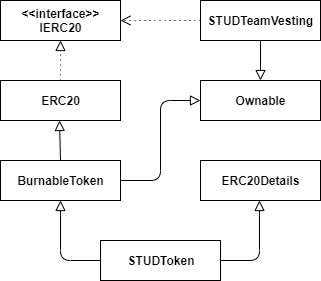

# Studyum Smart Contracts

#### Intro
There are two contracts deployed:
* STUD Token contract
* Team Vesting contract  
  
#### Deployment data
* deployment date = 28th of March 2021  
* initial totalSupply = 1 billion (1000000000000000000000000000 with 18 decimals)  
* decimals = 18  
* solidity version = 0.5.17  
* name = Studyum Token  
* symbol = STUD  
* version = v1  
* standard = ERC20  
* template = OpenZeppelin  

#### Etherscan links  

STUD Token:  
https://etherscan.io/token/0x8f48e457b4b0708c999a1e088c005e977cfdd707  
STUD Team vesting:  
https://etherscan.io/address/0xc18f55718260bb5a60eb5d99ec03576ae976c777  

#### UML Class diagram of contracts 

